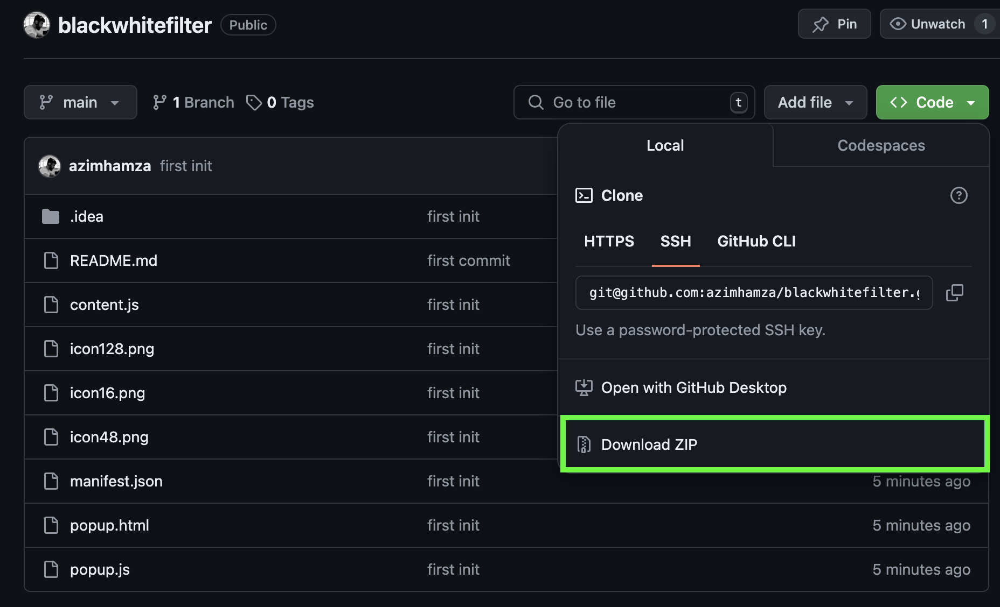
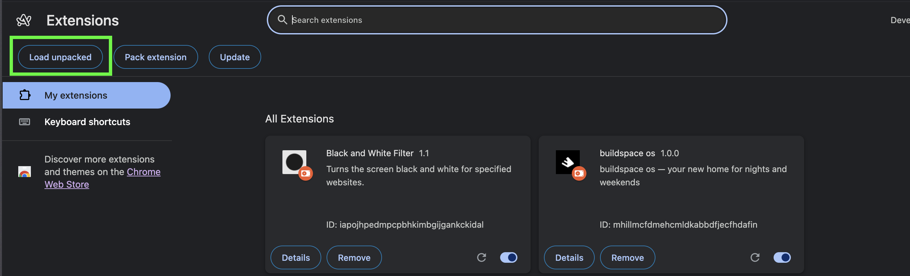
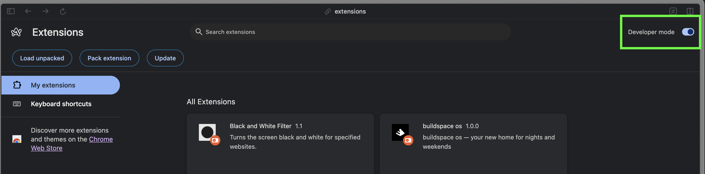
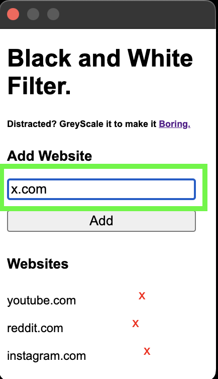
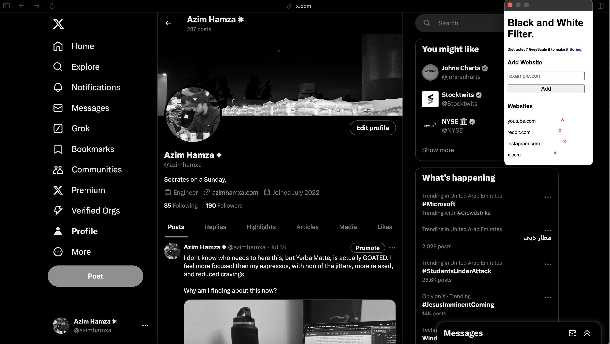

# Black and White Filter Chrome Extension

This Chrome extension allows you to apply a grayscale filter to specific websites of your choice.

## For Non-Developers

### Installation

1. Visit the GitHub repository page for this extension.
2. Click on the green "Code" button, then select "Download ZIP".
   
3. Once downloaded, unzip the file to a location you can easily find.
4. Open Google Chrome and go to `chrome://extensions/`.
5. In the top right corner, enable "Developer mode" by clicking the toggle switch.
   
6. Click on "Load unpacked" in the top left corner.
   
7. Navigate to the folder where you unzipped the extension files and select it.
8. The extension should now appear in your Chrome browser.

### Usage

1. Click on the extension icon in your Chrome toolbar.
2. In the popup, enter the domain of a website you want to apply the grayscale filter to (e.g., "example.com").
3. Click "Add" to add the website to your list.
   
4. Visit the website you added, and it should now appear in grayscale.
   
5. To remove a website from the list, click the "x" button next to it in the popup.

The extension consists of the following key files:

- `manifest.json`: The extension's configuration file.
- `popup.html` and `popup.js`: The UI and logic for the extension's popup.
- `content.js`: The script that runs on web pages to apply or remove the filter.

To make changes:

1. Modify the files as needed.
2. Go to `chrome://extensions/` and click the refresh icon on the extension card to reload it.
3. Test your changes.

### Contributing

1. Fork the repository.
2. Create a new branch for your feature or bug fix.
3. Make your changes and commit them with clear, descriptive messages.
4. Push your changes to your fork.
5. Submit a pull request to the main repository.

## Troubleshooting

If you encounter any issues:

1. Make sure the extension is enabled in `chrome://extensions/`.
2. Try removing and re-adding the website to your list.
3. Refresh the page you're trying to apply the filter to.
4. If problems persist, please open an issue on the GitHub repository with a detailed description of the problem.

# Non-Commercial Use License

Copyright (c) 2024 Azim Hamza

Permission is hereby granted, free of charge, to any person obtaining a copy of this software and associated documentation files (the "Software"), to use, copy, modify, merge, publish, distribute, and/or sublicense copies of the Software, and to permit persons to whom the Software is furnished to do so, subject to the following conditions:

1. The above copyright notice and this permission notice shall be included in all copies or substantial portions of the Software.

2. The Software may not be used for commercial purposes. "Commercial purposes" means any use of the Software intended for or directed toward commercial advantage or monetary compensation.

3. Redistributions of the Software, in whole or in part, must not be sold for a profit.

THE SOFTWARE IS PROVIDED "AS IS", WITHOUT WARRANTY OF ANY KIND, EXPRESS OR IMPLIED, INCLUDING BUT NOT LIMITED TO THE WARRANTIES OF MERCHANTABILITY, FITNESS FOR A PARTICULAR PURPOSE AND NONINFRINGEMENT. IN NO EVENT SHALL THE AUTHORS OR COPYRIGHT HOLDERS BE LIABLE FOR ANY CLAIM, DAMAGES OR OTHER LIABILITY, WHETHER IN AN ACTION OF CONTRACT, TORT OR OTHERWISE, ARISING FROM, OUT OF OR IN CONNECTION WITH THE SOFTWARE OR THE USE OR OTHER DEALINGS IN THE SOFTWARE.